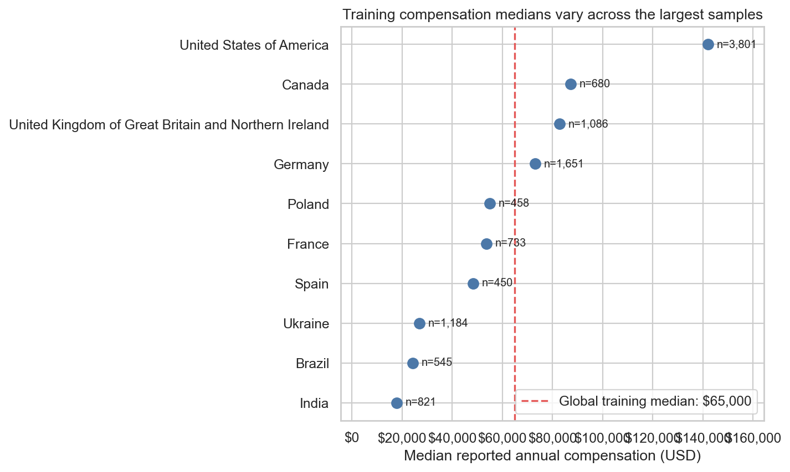
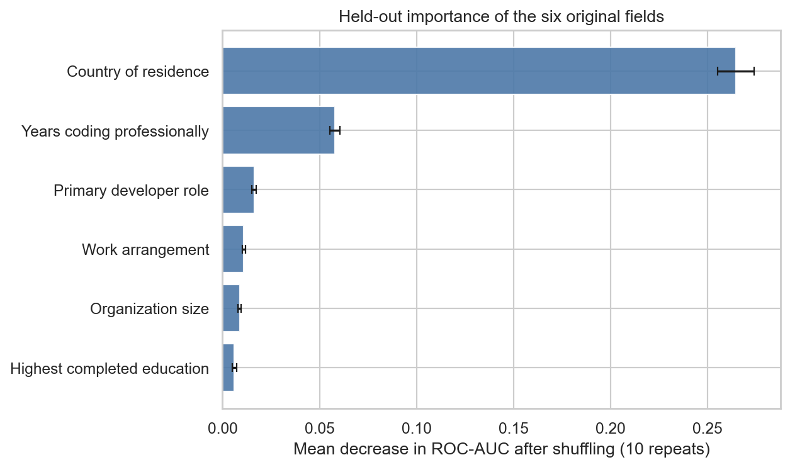
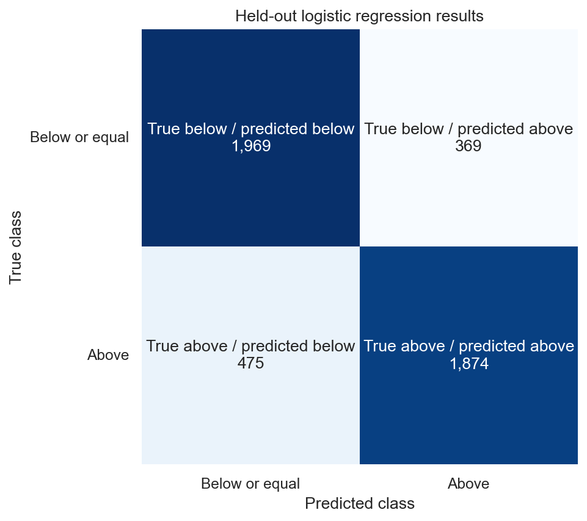

# Above the Median—But Whose Median? Four Lessons from Stack Overflow's 2024 Developer Survey

*Source: author's analysis of the 2024 Stack Overflow Developer Survey; annual compensation in U.S. dollars.*

What can six reported characteristics tell us about developer compensation? I studied 23,435 respondents with usable annual compensation. “Above the median” means strictly above the training sample's worldwide cutoff of $65,000—not above an industry standard or a measure of career success.

## 1. Which characteristics mattered most to the model?

Country of residence dominated. Shuffling country reduced the model's ranking score by 0.2647, compared with 0.0579 for professional coding experience, the second-ranked field. Role, work arrangement, organization size, and education had smaller effects. These are patterns the model used, not proof that changing any characteristic causes pay to change.

*Source: author's analysis. Bars show the average decrease across ten shuffles; lines show variation.*

## 2. Does the worldwide cutoff mean the same thing everywhere?

No. The largest training samples ranged from a $142,000 median in the United States to $17,945 in India. Among 3,527 held-out respondents in countries with enough training data, 27.4% switched above/below labels when their country's median replaced the worldwide cutoff. Neither view adjusts for local prices or living costs.

## 3. How accurate was the model on unseen respondents?

The model correctly classified 82.0% of 4,687 held-out respondents, compared with 49.9% for a baseline that ignored respondent details. It found 79.8% of respondents truly above the cutoff. The errors still matter: 369 below-cutoff respondents were placed above it, while 475 above-cutoff respondents were missed.

*Source: author's analysis. Each square combines a true and predicted class.*

## 4. What happened in a fictional experience scenario?

Both profiles used the same observed combination: United States, full-stack developer, bachelor's degree, an organization with 100–499 employees, and remote work.

| Profile | Professional experience | Predicted probability | Predicted class |
|---|---:|---:|---|
| Lower experience | 4 years | 92.3% | Above cutoff |
| Higher experience | 14 years | 97.0% | Above cutoff |

The probability rose by 4.8 percentage points, but both profiles stayed in the same class. This comparison is illustrative, not a forecast that ten more years will cause one person's pay to rise.

## What should readers keep in mind?

The survey was voluntary, compensation was self-reported total pay, and dollar conversion does not capture purchasing power. Results describe eligible respondents, not all developers. Read the [full notebook](stackoverflow_salary_analysis.ipynb) for the method, complete tables, and limitations.
